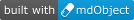

mdObject For Centricity
============


============

[](https://opensource.org/licenses/MS-PL)
[](https://www.npmjs.com/package/%40mdobject/mdobject)
[](https://www.npmjs.com/package/%40mdobject/mdobject)

See the [CHANGELOG](./CHANGELOG.md) for details of the changes in this release. 

Centricity is a brand of healthcare IT software solutions from GE Healthcare, a division of General Electric.

The Centricity products being acquired by Athenahealth and remand to:

    Centricity Practice Solution => athenaPractice (tm)
    Centricity EMR => athenaFlow (tm)
    Centricity EDI => athenaEDI (tm)

The GitHub GECentricity is subproject of mdObject initiative to simplify patient medical record exchange.
The mdObject is a simple JavaScript object stricture that is easy to implement and to use.

For users of GE Centricity EMR9.8 Evaluation version, execute the following line to enable ActiveX component:  

	Regsvr32 "C:\Program Files (x86)\Centricity EMR 9.8 Evaluation\GE.EMR.Msg.IF.dll"

Use IE9+ for the demo below. 

Default location for your own HTML Encounter forms in CPS12+:

	%JBOSS.SERVER.HOME.DIR%\server\default\deploy\demo.ear\CentricityPracticeWS.war\
    or
    C:\Program Files\Centricity Practice Solution\jboss\standalone\deployments\demo.ear\CentricityPracticeWS.war

EMR9.8 Evaluation: 
	
	C:\Program Files (x86)\Centricity EMR 9.8 Evaluation\jboss\server\default\deploy\Default.ear\CentricityPracticeWS.war\


Refer to https://forum.centricityusers.com/forum/anyone-have-cemr-9-8-evaluation-working-on-win-10-version-1607/ for issue with Windows10

To setup Angular demo page:

1. Create a new folder in the "Default location for your own HTML Encounter forms" called mdObject
2. Create a subfolder called __mdObjectAngularDemo__
3. Build Angular project:
    Open Command prompt (CMD) and navigate into the __mdObjectAngularDemo__ folder. Run the following commands:
        npm install
        npm run build

4. Copy content of the __\.\.\\mdObjectAngularDemo\\dist\\mdObjectAngularDemo\\__ folder into the __mdObjectAngularDemo__ folder.
5. Add a Quick Text as following:
__.mdObjectAngular__  
__{show_html_form("//localserver/mdObject/mdObjectAngularDemo/index.html","$mdObject Angular Demo Page")}__
5. Open patient chart and a new document 
6. Type __.mdObjectAngular__ and press Enter key.


To setup legacy demo page:

1. Create a new folder in the "Default location for your own HTML Encounter forms" called mdObject
2. Create a subfolder called __mdObjectDemo__
3. Copy content of the __\.\.\\mdObject\\examples\\angular.js\\__ folder into the __mdObjectDemo__ folder.
4. Add a Quick Text as following:
__.mdobject__  
__{show_html_form("//localserver/mdObject/mdObjectDemo/index.html","$mdObject Feature Demo Page")}__
5. Open patient chart and a new document 
6. Type __.mdobject__ and press Enter key.


Here is the example how to create a new observation (jQuery is used below to pull the height value from HTML control):

    var currentDate = new Date();
    var obsDate = (currentDate.getMonth() + 1) + '/' + currentDate.getDate() + '/' + currentDate.getFullYear();
    var height = $("#Height").val();
    var heightObs = new $mdObject.Observation();
    heightObs.name = "HEIGHT";
    heightObs.value = height;
    heightObs.date = obsDate;
    heightObs.save();

## To build library
    npm install
    npm run build:libraries

## Library usage
    Use ```import { MdObject, Patient,... } from '@mdobject/mdobject';``` to avoid the ```Module not found: Error: Can't resolve '@mdobject/mdobject/clssess' in 'xyz'``` error.
    See the mdObjectAngularDemo project for details

## Badges

Show your support by adding a **built with mdObject** badge to your projects README or website.

[](https://mdObject.com/)

